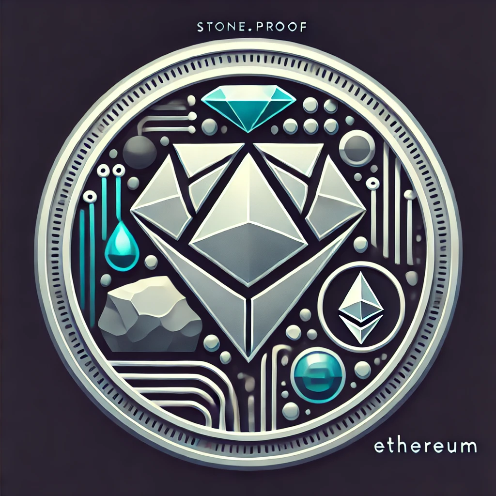
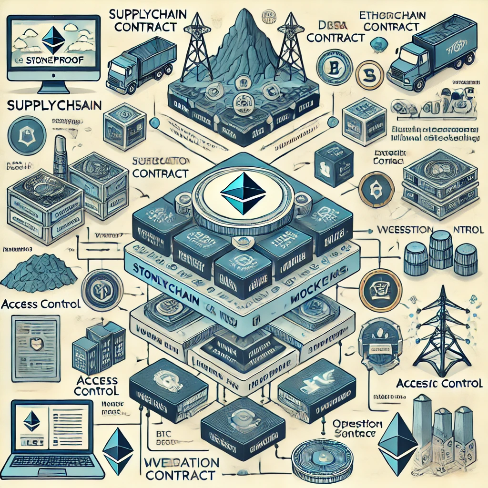

# stone.proof
<!--  -->

<br>
<br>

[License](./LICENCE)

<br>
## About
<div>
StoneProof is an innovative blockchain-based application designed to enhance transparency, traceability, and trust in the mineral supply chain. Built on the Ethereum blockchain using Scaffold-ETH 2, StoneProof leverages smart contract technology to provide a decentralized solution for digital certification of mineral assets.

</div>

## Table of Contents
- [Features](#features)
- [Problem Statement](#problem-statement)
- [Installation](#installation)
- [Usage](#usage)
- [Architecture](#architecture)
- [API Reference](#api-reference)
- [Testing](#testing)
- [Contributing](#contributing)
- [License](#license)
- [Acknowledgments](#acknowledgments)
- [Contact Information](#contact-information)
- [Future Work](#future-work)

## Features
- Scaffold-eth2 tool
- Oppenzeppelin secure contracts
- Hardhat tool
- Modern wallet integration
- Enahnced testing
- Sleek User Interface
- Seamless interaction with dApp


## Problem Statement
<div>
In an industry often plagued by issues such as fraud, lack of traceability, and opaque supply chains, <b>stone.proof</b> addresses these challenges by introducing a reliable, secure, and transparent method for managing mineral assets. By integrating blockchain technology, <b>stone.proof</b> revolutionizes how minerals are tracked and certified, empowering businesses to build trust with their clients and stakeholders.
</div>


## Installation
```sh
### Blockchain section

### Frontend section


```

## Usage
On The Landing page, Navigate to the top right corner and click `Connect wallet`
After clicking `Connect wallet`, you'll see a bunch of installed wallets if none installed, you should create one.
Once the wallet is connected, The connected user is then authorized and given permission to claim role they wanna play in the mining industry
either Miner, Refiner, Auditor, Inspector and many others according to Participants contract!

Once the User claims role, they are first verified for any token holdings using the address. If wallet address owns no token, They might be given chance to claim mineralToken or flagged as unAuthorised participant.

With provided services, We plan on real time tracking of the whole Supply chain from the mining stations, refining factories and finally to the destination - Final consumers
focusing on Traceability, Integrity and pure quality of minerals.

With further development, we plan to make this project a bigger one with modern and scalable feature implementation to make this project even a bigger thing.

## Architecture

**Client Interface (UI/UX Layer):**

Users (like mining companies, auditors, and stakeholders) access StoneProof through a web interface or mobile application.
Built with modern front-end frameworks, it interacts with the Ethereum blockchain through wallet integrations, such as MetaMask.

**Smart Contracts Layer (Ethereum Blockchain):**

_**SupplyChain Contract:**_ 
Manages and verifies mineral sourcing and tracking data, ensuring transparency from mining to delivery.
ERC-721 Compliant Tokens (Mineral Tokens): Represent unique batches or individual minerals, securing proof of origin.
Access Control: Defines permissions and ownership to protect sensitive supply chain data, using role-based access (e.g., for miners, auditors, etc.).
Verification Contract: Handles cross-checks with regulatory and quality standards, enabling automated compliance checks.

**Backend Services (Optional Off-Chain Storage & Processing):**

- Utilizes services such as IPFS or a secure cloud storage solution for storing non-critical metadata (such as certifications and detailed tracking info) that would be too costly to store directly on-chain.
Off-chain services may also support data indexing, providing efficient querying capabilities for users via the client interface.

**Deployment & Development Infrastructure:**

Built on Scaffold-ETH 2 for rapid development, with Hardhat for compiling, testing, and deploying contracts.
Deployment Workflow: Automated deployment scripts handle the sequential deployment of smart contracts, ensuring seamless updates across testnet and mainnet environments (e.g., Sepolia, Polygon).

*Security & Verification:*

Each transaction and token transfer is cryptographically secured through Ethereum’s native features.
Smart contracts are unit-tested and audited to prevent vulnerabilities, ensuring reliable tracking and traceability of mineral resources.


## API Reference
All the APIs and RPC URL Endpoints used throught the project are gotten from [Alchemy](https://alchemy.com/)

## Testing
The tests used throught the project mostly especially smart contracts are done using hardhat testing environment and the accounts used in the projects are are all mocks and hold zero serious Eth - All Eth used is fake and is for testing purposes only.

## Contributing
Want to give a hand on the development of this project??
Get started by submitting a PR on this project repo, <https://github.com/0xJonaseb11/stone.proof.3.0.git>

## License
This is an open source project that can be changed in the future if found necessary. Use it for your own needs but without not intended copyright!!
[License](./LICENSE)

## Acknowledgments
I want to express my sincere gratitude to the following individuals and resourceful companies for making this project possible:


**Irere Emmanuel(@Irere123)** :: For his assistance in developing the best modern ever-to-exist User Interface for seamless interaction with smartcontracts.
<br>
**[Openzeppelin](https://www.openzeppelin.com/)** :: For their robust libraries and tools that streamlined the smart contract development process.
<br>
**[Scaffold-ETH2](https://scaffold-eth-2-docs.vercel.app/quick-start)**:: For providing a solid foundation for building Ethereum applications quickly.
<br>
**[Ethereum Organisation](https://ethereum.org/en/developers/docs/)**:: For serving as a comprehensive resource for understanding Ethereum development.

_**Thank you all for your support and contributions!**_


## Contact Information
With collaboration or guidance on this or future projects, feel free to reach out to us at <sebejaz99@gmail.com>

## Future Work
As our team plans to make this project a big one, we plan to introduce the use of Hyperledger fabric to develop the same but improved version of this project to facilitate Confidential Enterprise-based solutions.

-----------------------------------
@0xJonaseb11 🤝 @Irere123
